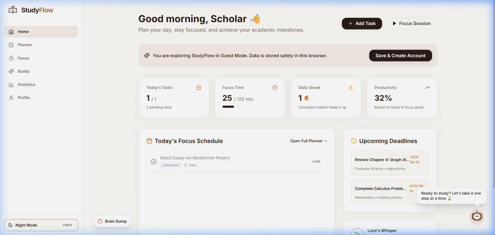
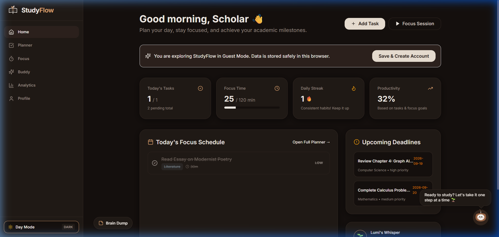
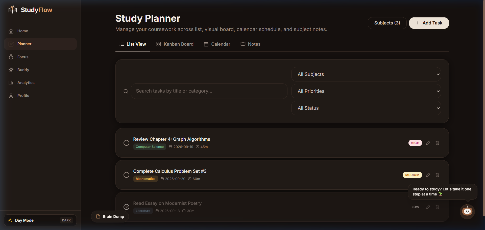
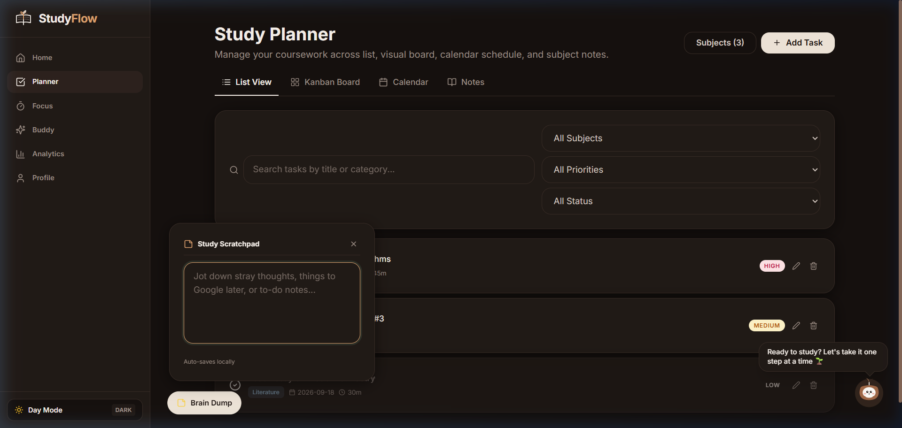
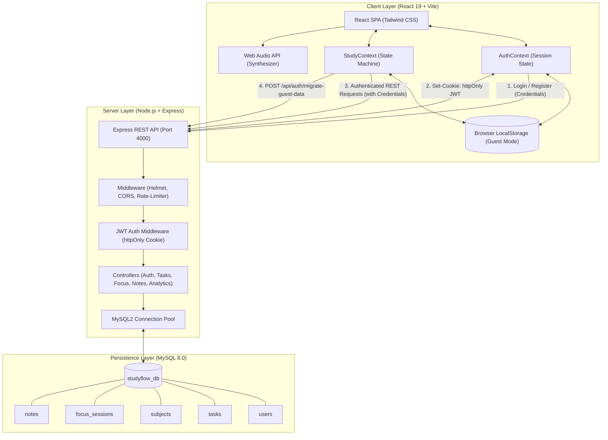

<div align="center">

# 🌿 StudyFlow

### *A Calm, Distraction-Free Student Productivity Workspace*

[](https://react.dev/)
[](https://vitejs.dev/)
[](https://tailwindcss.com/)
[](https://nodejs.org/)
[](https://expressjs.com/)
[](https://www.mysql.com/)
[](LICENSE)

[Report Bug](https://github.com/gkaviya12/studyflow/issues) • [Request Feature](https://github.com/gkaviya12/studyflow/issues)

</div>

---

## 📖 Table of Contents

- [Overview](#-overview)
- [Why StudyFlow](#-why-studyflow)
- [UI Showcase](#-ui-showcase)
- [Key Features](#-key-features)
- [System Architecture](#-system-architecture)
- [Technology Stack](#-technology-stack)
- [Engineering Highlights](#-engineering-highlights)
- [Quick Start Guide](#-quick-start-guide)
- [Environment Variables](#-environment-variables)
- [Project Directory Structure](#-project-directory-structure)
- [API Endpoints Reference](#-api-endpoints-reference)
- [Running Automated Tests](#-running-automated-tests)
- [Future Roadmap](#-future-roadmap)
- [Contributing](#-contributing)
- [License](#-license)
- [Author](#-author)

---

## 🎯 Overview

**StudyFlow** is a full-stack student productivity workspace built to address academic workflow fragmentation. Students frequently juggle separate, disconnected tools for assignment scheduling, Pomodoro timing, background ambient sounds, lecture notes, and study analytics. StudyFlow consolidates these essentials into a unified, single-page application wrapped in a distraction-free **Warm Espresso & Paper** theme designed to minimize eye strain during extended study sessions.

Built with **guest mode and local persistence**, StudyFlow allows immediate usage without upfront sign-up friction via browser `localStorage`. When ready, students can register or log in, triggering a transactional cloud-migration pipeline that moves local data into a persistent MySQL account.

---

## 💡 Why StudyFlow?

| Problem in Student Workflows | StudyFlow Solution |
| :--- | :--- |
| **Tab overload & context switching** across separate apps for timers, to-do lists, ambient noise, and notes. | **Unified workspace**: Integrated planner (List & Kanban), Pomodoro timer, ambient soundboard, notes, and scratchpad within one SPA. |
| **Sign-up friction**: Forced account creation before students can evaluate if the tool fits their routine. | **Instant Guest Mode**: Fully functional with local persistence via `localStorage`, backed by a 1-click cloud migration pipeline upon registration. |
| **Audio streaming overhead** from external YouTube/Spotify background streams during focus sessions. | **Procedural Web Audio Engine**: Zero-asset ambient soundscapes (*Rain*, *Cafe*, *White Noise*, *Lo-Fi*) synthesized in-browser using the Web Audio API. |
| **Visual fatigue** from harsh neon or high-contrast dashboards during late-night study sessions. | **Warm Espresso / Paper Theme**: Curated parchment (`#FDFBF7`) and dark chocolate roast (`#15100E`) palette with smooth `0.3s ease` transitions. |

---

## 📸 UI Showcase

| View | Screenshot |
| :--- | :--- |
| **Dashboard (Warm Paper)** | <br><sub>*Overview: Daily schedule, streak counter, weekly focus chart, and quick stats.*</sub> |
| **Dashboard (Dark Roast)** | <br><sub>*Night Mode: Deep espresso roast palette (`#15100E`) reducing screen glare.*</sub> |
| **Coursework Planner** | <br><sub>*Task organization: Filter by priority, subject, status, and due dates.*</sub> |
| **Brain Dump Scratchpad** | <br><sub>*Quick drawer: Capture stray thoughts with autosave and 1-click "Send to Planner".*</sub> |

> *Additional views (Zen Fullscreen Pomodoro, Companion Sanctuary, and Analytics Breakdown) can be captured into `docs/screenshots/`.*

---

## ✨ Key Features

### 📅 Coursework Planner (List & Kanban Views)
- **Multi-criteria Filtering**: Filter tasks by coursework subject, priority (High, Medium, Low), status, and due dates.
- **Interactive Kanban Board**: Visual task transitions across *To Do*, *In Progress*, and *Completed* stages.
- **Coursework Notes**: Multiline notes organized with subject tagging, search tags, and debounced saving.

### ⏱️ Zen Focus Timer & Procedural Audio
- **Flexible Intervals**: Standard 25m Pomodoro, 50m Deep Focus, or 15m Quick Review with break reminders.
- **Distraction-Free Zen Mode**: Fullscreen countdown interface with animated progress ring and `Esc` keyboard shortcut.
- **Procedural Ambient Soundboard**: Browser-synthesized audio powered by the Web Audio API—generates *Rainfall*, *Coffeehouse*, *White Noise*, and *Lo-Fi Hum* without external audio files.
- **Completion Chime**: Sinusoidal chime modeling a Tibetan singing bowl to signal interval completion.

### 🌿 Lumi — Virtual Study Companion
- **State-Driven Mascot**: Unobtrusive companion that reacts to focus sessions, completed tasks, and study breaks.
- **Milestone Unlocks**: Unlocks visual accessories as students maintain consistency:
  - 👓 **Scholar Glasses** (2+ completed focus sessions)
  - ☕ **Warm Espresso Mug** (4+ completed focus sessions)
  - ✨ **Golden Halo / Aura** (2+ day consecutive study streak)

### 📝 Brain Dump (Quick Scratchpad)
- **Frictionless Capture**: Floating drawer positioned cleanly outside navigation zones, accessible from any page.
- **Persistent Local Autosave**: Stray thoughts and quick reminders persist across reloads in `localStorage`.
- **1-Click Conversion**: Converts the first line of any note directly into a structured planner task.

### 📊 Productivity Analytics & Habit Tracking
- **Consecutive Day Streaks**: Tracks daily study consistency automatically.
- **Dynamic Aggregations**: Query-time computation of study minutes, completion rates, and subject breakdowns without redundant table writes.

---

## 🏗️ System Architecture

StudyFlow implements a decoupled client-server architecture with strict separation of concerns, secure stateless JWT authentication, and an offline fallback layer.



### Authentication & Data Migration Flow
1. **Guest Session**: Users can use the app immediately without an account. Entities (`tasks`, `subjects`, `notes`, `focus_sessions`) are stored locally via `guestStorage.js`.
2. **Account Creation**: Upon registration (`POST /api/auth/register`), input is validated via `express-validator`, passwords are hashed with `bcrypt` (12 salt rounds), and the record is created in MySQL.
3. **Cookie Issuance**: The JWT is returned inside an `httpOnly`, `SameSite=Lax`, `Secure` (in production) cookie. JavaScript code in the browser cannot read this token.
4. **Data Migration**: If guest records exist in `localStorage`, the client calls `POST /api/auth/migrate-guest-data` in a single transaction. The server validates and attributes the rows to the user, rolling back on error and clearing client-side cache only on success.

---

## 💻 Technology Stack

### Frontend
- **Core:** [React 19](https://react.dev/), [Vite 6](https://vitejs.dev/)
- **Routing:** [React Router DOM 7](https://reactrouter.com/)
- **Styling:** [Tailwind CSS 3.4](https://tailwindcss.com/), CSS Custom Properties (Theme tokens)
- **Icons:** [Lucide React](https://lucide.dev/)
- **Visualizations:** [Chart.js 4](https://www.chartjs.org/) + `react-chartjs-2`
- **Audio:** Web Audio API (native procedural synthesis)
- **HTTP Client:** [Axios](https://axios-http.com/) (`withCredentials: true`)

### Backend
- **Runtime:** [Node.js](https://nodejs.org/) (ES Modules)
- **Framework:** [Express 4.21](https://expressjs.com/)
- **Authentication:** [jsonwebtoken](https://github.com/auth0/node-jsonwebtoken), `cookie-parser`
- **Security:** [helmet](https://helmetjs.github.io/), [bcrypt](https://github.com/kelektiv/node.bcrypt.js) (12 rounds), [express-rate-limit](https://github.com/express-rate-limit/express-rate-limit), [express-validator](https://express-validator.github.io/)
- **Database Driver:** [mysql2](https://github.com/sidorares/node-mysql2) (Promise-based connection pool)
- **Mailing:** [nodemailer](https://nodemailer.com/) (Password reset delivery)

### Database & DevOps
- **Database:** [MySQL 8.0](https://www.mysql.com/)
- **Containerization:** Docker, Docker Compose
- **Testing:** [Vitest](https://vitest.dev/) (Client), [Jest](https://jestjs.io/) (Server)
- **Monorepo Tooling:** npm Workspaces, `concurrently`

---

## ⚡ Engineering Highlights

1. **Zero-Asset Procedural Audio Synthesis (`soundEngine.js`)**
   Rather than streaming large external MP3/WAV audio files over the network, StudyFlow synthesizes continuous ambient soundscapes directly in the browser's audio buffer using the Web Audio API (`AudioContext`, `BiquadFilterNode`, `GainNode`, and procedural noise buffers). This eliminates audio bandwidth consumption, avoids network buffering, and ensures ambient audio functions offline.

2. **Transactional Guest-to-Cloud Data Migration**
   To reduce onboarding friction, students can use StudyFlow immediately in guest mode. When registering, the client bundles offline records from `localStorage` and submits them to `POST /api/auth/migrate-guest-data`. The server executes the ingestion inside a MySQL transaction (`connection.beginTransaction()`, `commit()`, `rollback()`) with field whitelisting, rolling back on error and purging client cache only on success.

3. **Secure Cookie-Based JWT Architecture**
   Instead of storing JWT tokens in `localStorage` where they are vulnerable to Cross-Site Scripting (XSS), StudyFlow issues tokens in `httpOnly`, `SameSite=Lax` cookies with an explicit CORS origin. This prevents client JavaScript from accessing the session token and mitigates CSRF risk.

4. **Query-Time Analytics on Normalized Tables**
   Rather than maintaining denormalized summary tables that risk consistency drift, metrics (weekly focus hours, completion rates, study streaks) are calculated dynamically at query time from normalized `tasks` and `focus_sessions` tables. Targeted compound indexes (`idx_tasks_user_status`, `idx_focus_user_started`) optimize read performance.

5. **Semantic Design Token Architecture**
   Semantic CSS custom properties defined in `:root` and `[data-theme="dark"]` drive both themes. A single DOM attribute toggle updates backgrounds, typography, cards, and buttons with smooth `0.3s ease` CSS transitions.

---

## 🚀 Quick Start Guide

### Prerequisites
- [Node.js](https://nodejs.org/) (v18 or higher)
- [Git](https://git-scm.com/)
- [Docker Desktop](https://www.docker.com/) *(optional, for running MySQL via container)* or a local MySQL 8 instance

---

### 1. Clone the Repository
```bash
git clone https://github.com/gkaviya12/studyflow.git
cd studyflow
```

### 2. Install Dependencies
Install packages across client and server workspaces:
```bash
npm install
```

### 3. Configure Environment Variables
Copy the example environment file:
```bash
cp .env.example .env
```
*(Verify that `DB_HOST`, `DB_USER`, `DB_PASSWORD`, and `JWT_SECRET` match your local environment).*

### 4. Setup the Database

#### Option A: Run MySQL via Docker (Recommended)
```bash
docker compose up -d
```

#### Option B: Use Local MySQL Server
Ensure MySQL is running on port 3306, then create the database:
```sql
CREATE DATABASE studyflow_db;
```

#### Run Migrations & Seeds
Populate the schema and starter seed data:
```bash
npm run db:reset
```
*Default test credentials: `demo@studyflow.com` / `Test1234!`*

### 5. Launch the Application
Start both the backend server and frontend client concurrently:
```bash
npm run dev
```

- **Client Application:** [http://localhost:5173](http://localhost:5173)
- **Backend API:** [http://localhost:4000](http://localhost:4000)
- **Health Endpoint:** [http://localhost:4000/health](http://localhost:4000/health)

---

## 🔐 Environment Variables

The server reads configuration from `.env`:

| Variable | Description | Example / Default |
| :--- | :--- | :--- |
| `PORT` | Port for Express backend server | `4000` |
| `NODE_ENV` | Runtime environment (`development` or `production`) | `development` |
| `DB_HOST` | MySQL database host address | `localhost` |
| `DB_USER` | MySQL database user | `root` |
| `DB_PASSWORD` | MySQL database password | `root` |
| `DB_NAME` | MySQL database schema name | `studyflow_db` |
| `JWT_SECRET` | Secret key for signing and verifying JWTs | `your-secret-key-change-in-prod` |
| `COOKIE_NAME` | Name of the authentication cookie | `studyflow-jwt` |
| `JWT_COOKIE_MAX_AGE` | Expiration duration for session cookie in milliseconds | `604800000` *(7 days)* |
| `CLIENT_URL` | Allowed origin for CORS (frontend location) | `http://localhost:5173` |
| `SMTP_HOST` | SMTP server for password reset emails | `smtp.mailtrap.io` |
| `SMTP_PORT` | SMTP server port | `2525` |
| `SMTP_USER` | SMTP authentication username | `dev` |
| `SMTP_PASSWORD` | SMTP authentication password | `dev` |
| `SMTP_FROM` | Sender address for system emails | `no-reply@studyflow.com` |
| `RESET_TOKEN_EXPIRY_MINUTES` | Password reset token expiration window | `60` |

> [!WARNING]
> Never commit your real `.env` file to source control. The `.gitignore` file is pre-configured to exclude `.env` while tracking `.env.example`.

---

## 📁 Project Directory Structure

```text
studyflow/
├── client/                     # Frontend React SPA
│   ├── public/                 # Static public assets & favicon
│   ├── src/
│   │   ├── components/         # Reusable UI widgets
│   │   │   ├── Lumi.jsx            # Interactive mascot companion & evolutions
│   │   │   ├── QuickScratchpad.jsx # Persistent brain dump drawer
│   │   │   └── StudyFlowLogo.jsx   # Official SVG brand mark
│   │   ├── context/            # Global React contexts
│   │   │   ├── AuthContext.jsx     # User session & migration logic
│   │   │   ├── StudyContext.jsx    # Tasks, focus, notes state management
│   │   │   └── ThemeContext.jsx    # Day/Night theme switcher
│   │   ├── layouts/            # Page layouts
│   │   │   └── AppLayout.jsx       # Responsive desktop sidebar & mobile shell
│   │   ├── pages/              # Primary route views
│   │   │   ├── DashboardPage.jsx   # Schedule, overview stats & tips
│   │   │   ├── PlannerPage.jsx     # Dual-view List & Kanban planner
│   │   │   ├── FocusPage.jsx       # Pomodoro timer & Zen fullscreen mode
│   │   │   ├── BuddyPage.jsx       # Companion sanctuary & accessories
│   │   │   ├── AnalyticsPage.jsx   # Habit & study time visual charts
│   │   │   ├── ProfilePage.jsx     # Preferences, daily goals & sync
│   │   │   ├── LoginPage.jsx       # Split-screen sign in view
│   │   │   ├── RegisterPage.jsx    # Account registration view
│   │   │   ├── ForgotPasswordPage.jsx
│   │   │   ├── ResetPasswordPage.jsx
│   │   │   ├── LandingPage.jsx     # Marketing page
│   │   │   └── NotFoundPage.jsx    # 404 handler
│   │   ├── services/           # Network & storage adapters
│   │   │   ├── api.js              # Axios instance with credentials
│   │   │   └── guestStorage.js     # localStorage offline fallback
│   │   ├── utils/              # Utilities & engines
│   │   │   └── soundEngine.js      # Procedural Web Audio synthesizer
│   │   ├── index.css           # Design tokens (Warm Espresso / Paper)
│   │   ├── App.jsx             # Router definition
│   │   └── main.jsx            # React root mount
│   ├── tailwind.config.js      # Tailwind design configuration
│   └── vite.config.js          # Vite build configuration
│
├── server/                     # Backend Node.js REST API
│   ├── config/
│   │   └── database.js         # MySQL2 connection pool setup
│   ├── controllers/            # Controller business logic
│   │   ├── analytics.controller.js # Aggregation and metrics calculations
│   │   ├── auth.controller.js      # Registration, auth cookies & migration
│   │   ├── focus.controller.js     # Session start, completion & streaks
│   │   ├── note.controller.js      # Notes CRUD & search
│   │   ├── profile.controller.js   # User profiles & goal settings
│   │   ├── subject.controller.js   # Coursework subjects
│   │   └── task.controller.js      # Task CRUD & status transitions
│   ├── middleware/             # Express middlewares
│   │   ├── auth.middleware.js      # JWT verification from httpOnly cookie
│   │   └── error.middleware.js     # Centralized error response envelope
│   ├── routes/                 # Endpoint routing definitions
│   │   ├── analytics.routes.js
│   │   ├── auth.routes.js
│   │   ├── focus.routes.js
│   │   ├── note.routes.js
│   │   ├── profile.routes.js
│   │   ├── subject.routes.js
│   │   └── task.routes.js
│   ├── scripts/
│   │   └── db-reset.js         # Database drop, migration and seed script
│   └── server.js               # Application bootstrap & route registration
│
├── database/                   # Database scripts
│   ├── schema.sql              # MySQL DDL with foreign keys & indexes
│   └── seed.sql                # Seed data for local testing
│
├── docs/                       # Architecture & documentation specifications
│   ├── 00_MASTER DOCUMENTATION.md
│   ├── 01_PRD.md               # Product Requirements Document
│   ├── 02_TRD.md               # Technical Requirements Document
│   ├── 03_APP-FLOW.md          # User journeys & routing maps
│   ├── 04_UI_UX_DESIGN_SYSTEM.md
│   ├── StudyFlow_Auth_API.postman_collection.json # Ready-to-use Postman collection
│   └── screenshots/            # Repository visual assets
│
├── docker-compose.yml          # Container configuration for MySQL 8
├── package.json                # Root workspaces manifest
└── README.md                   # Repository landing documentation
```

---

## 📡 API Endpoints Reference

All protected endpoints require an authenticated `httpOnly` JWT session cookie.

<details>
<summary><strong>🔐 Authentication Routes (<code>/api/auth</code>)</strong></summary>

| Method | Endpoint | Access | Description |
| :--- | :--- | :--- | :--- |
| `POST` | `/api/auth/register` | Public | Register user (`name`, `email`, `password`) & issue cookie |
| `POST` | `/api/auth/login` | Public | Authenticate credentials & issue cookie |
| `POST` | `/api/auth/logout` | Authenticated | Clear session cookie |
| `POST` | `/api/auth/forgot-password` | Public | Request password reset email |
| `POST` | `/api/auth/reset-password` | Public | Reset password using valid token |
| `GET` | `/api/auth/profile` | Authenticated | Retrieve authenticated user profile |
| `PUT` | `/api/auth/profile` | Authenticated | Update profile details, theme, and goals |
| `POST` | `/api/auth/migrate-guest-data`| Authenticated | Ingest and attribute offline guest data |

</details>

<details>
<summary><strong>📋 Task Routes (<code>/api/tasks</code>)</strong></summary>

| Method | Endpoint | Access | Description |
| :--- | :--- | :--- | :--- |
| `GET` | `/api/tasks` | Authenticated | List tasks (supports `?status=`, `?subjectId=`, `?page=`, `?limit=`) |
| `POST` | `/api/tasks` | Authenticated | Create a new task |
| `PUT` | `/api/tasks/:id` | Authenticated | Update task title, status, priority, or due date |
| `DELETE`| `/api/tasks/:id` | Authenticated | Remove task |

</details>

<details>
<summary><strong>⏱️ Focus Timer Routes (<code>/api/focus</code>)</strong></summary>

| Method | Endpoint | Access | Description |
| :--- | :--- | :--- | :--- |
| `POST` | `/api/focus/start` | Authenticated | Start a new focus session (`planned_minutes`, `task_id?`) |
| `POST` | `/api/focus/complete` | Authenticated | Complete session & log streak calculation |
| `POST` | `/api/focus/abandon` | Authenticated | Abandon session (logs elapsed time without streak credit) |
| `GET` | `/api/focus/history` | Authenticated | Retrieve historical focus sessions |

</details>

<details>
<summary><strong>📚 Subject & Note Routes (<code>/api/subjects</code>, <code>/api/notes</code>)</strong></summary>

| Method | Endpoint | Access | Description |
| :--- | :--- | :--- | :--- |
| `GET` | `/api/subjects` | Authenticated | List coursework subjects |
| `POST` | `/api/subjects` | Authenticated | Create a subject category |
| `PUT` | `/api/subjects/:id` | Authenticated | Update subject details |
| `DELETE`| `/api/subjects/:id` | Authenticated | Delete subject |
| `GET` | `/api/notes` | Authenticated | List notes (supports `?subjectId=`, pagination) |
| `POST` | `/api/notes` | Authenticated | Create study note |
| `PUT` | `/api/notes/:id` | Authenticated | Update study note content |
| `DELETE`| `/api/notes/:id` | Authenticated | Remove study note |

</details>

<details>
<summary><strong>📊 Analytics & Profile Routes (<code>/api/analytics</code>, <code>/api/profile</code>, <code>/health</code>)</strong></summary>

| Method | Endpoint | Access | Description |
| :--- | :--- | :--- | :--- |
| `GET` | `/api/analytics` | Authenticated | Aggregated metrics (streak, completion rate, focus hours) |
| `GET` | `/api/profile` | Authenticated | Retrieve user profile settings |
| `PUT` | `/api/profile` | Authenticated | Update profile details and daily target minutes |
| `GET` | `/health` | Public | Service health verification |

</details>

---

## 🧪 Running Automated Tests

StudyFlow maintains 36 automated unit and integration tests across both the client and server workspaces.

### Run Frontend Tests (Vitest)
```bash
npm test --workspace=client -- --run
```
*Executes 9 tests in `client/src/context/AuthContext.test.jsx`, validating session states, guest flags, and profile update flows.*

### Run Backend API Tests (Jest)
```bash
npm test --workspace=server
```
*Executes 27 integration tests in `server/__tests__/auth.controller.test.js`, validating controller validation logic, bcrypt password hashing, and MySQL transaction rollbacks.*

---

## 🗺️ Future Roadmap

- [ ] **Native Calendar Integration**: Two-way synchronization with Google Calendar and iCal feeds.
- [ ] **AI Study Assistant**: Automated generation of practice quizzes from study notes.
- [ ] **Collaborative Study Rooms**: Real-time shared focus rooms with synchronized timers via WebSockets.
- [ ] **Desktop Companion**: Lightweight desktop build using Electron or Tauri with system tray controls.

---

## 🤝 Contributing

Contributions are welcome! If you'd like to improve StudyFlow:

1. Fork the repository (`https://github.com/gkaviya12/studyflow.git`).
2. Create your feature branch (`git checkout -b feature/amazing-feature`).
3. Commit your changes (`git commit -m 'feat: add amazing feature'`).
4. Push to the branch (`git push origin feature/amazing-feature`).
5. Open a Pull Request.

---

## 📄 License

This project is licensed under the **MIT License** — see the [LICENSE](LICENSE) file for details.

---

## 👤 Author

**Kaviya G**
- **GitHub:** [@gkaviya12](https://github.com/gkaviya12)
- **LinkedIn:** [g-kaviya](https://www.linkedin.com/in/g-kaviya)

<div align="center">
  <sub>Built with care to bring focus and calm to student workspaces 📖✨</sub>
</div>